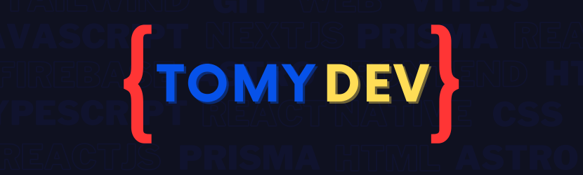

# Hi there 👋, I'm Tomás Santa Cruz

- 👨‍💻 Frontend Developer from Argentina
- 🏫 Studying in computer science at Technical School No. 35.
- 🛠️ My tech toolkit includes React, React Native, Next.js, TypeScript and Tailwind.

### Technologies I normally use for:

#### Frontend

#### Backend

### Visit my:

**[Website](https://tomydev.me/) - [Blog](https://tomydev-blog.vercel.app/en)**

